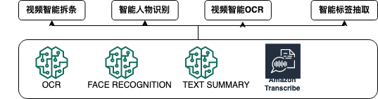

AI加速视频内容智能生产

# architecture



# quick start
```shell script
# 智能拆条
python create_endpoint.py
python main_chaitiao.py
```

```shell script
# ocr 字幕
python main_ocr_zimu.py
```

```shell script
# keyword, key phrase extraction

endpoint_ecr_image="847380964353.dkr.ecr.us-west-2.amazonaws.com/textrank"
python create_endpoint.py \
--endpoint_ecr_image_path ${endpoint_ecr_image} \
--endpoint_name 'textrank' \
--instance_type "ml.t2.medium"

python keywords.py
```